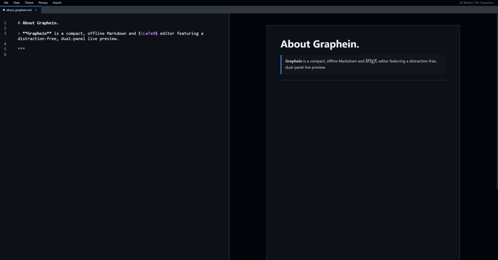

# Graphein 

> Compact, offline Markdown and $\LaTeX$ editor for Windows, featuring a distraction-free, dual-panel live preview with zero setup bloat.

Tired of Electron-based Markdown editors eating hundreds of megabytes on disk just to render notes? Graphein brings a native-like, lightweight footprint (~11 MB installer, max 30 MB on disk) while offering full web-grade rendering for complex mathematics, code blocks, and diagrams.



***

## Features


* **Adaptive Image Coloring (Auto Dark/Light Diagrams):** Automatically analyses and adapts pasted screenshots and diagrams to blend seamlessly into your active editor theme without touching or converting the original files. White backgrounds invert and match your UI dynamically.
* **Live Markdown, Math & Code Support:** Real-time dual-panel preview with KaTeX math rendering, syntax-highlighted code blocks, and custom HTML/CSS flexibility.
* **Bi-Directional Double-Click Sync:** Double-click any element in the preview pane to instantly jump to its source line in the editor, or double-click in the editor to focus that exact block in the preview.
* **Built-in Quick Reference Sheet:** An integrated, collapsible side drawer with quick syntax cheatsheets for common Markdown markup and $\LaTeX$ symbols/matrices.
* **On-Demand Multi-Language Spell Check:** Windows-native dictionary integration via ctypes. Check up to 3 languages simultaneously via right-click without ugly, permanent red squiggles ruining your formulas or code.
* **Auto-Managed Local Assets:** Pasting images automatically extracts PNGs into a clean, relative document folder (`assets_<docname>/`), and cleans up unused images when you save.
* **Zero Bloat & Edge-Engine PDF Export:** Headless Chromium/Edge integration prints clean A4 paginated PDFs without shipping heavy browser bundles.
* **Low disk footprint:** The installation file is only 11 MB in size. The total disk footprint after installation is only 30 MB, since it uses the build-in windows WebView2 as render engine.


***

### Installation
> Requirements:
> - windows 10/11
> - Python 3.10+
> - Microsoft Edge WebView2 runtime (pre-installed on modern Windows)

1. Clone the repository:
```bash
git clone https://github.com/henk08/graphein.git
cd graphein

```


2. Install dependencies:
```bash
pip install -r requirements.txt

```


3. Launch the application:
```bash
python markdown.py

```


***

## Disclaimer

> ⚠️ **Heads up:** This project was 100% vibe-coded just to build something for myself, so expect messy comments, mixed Dutch/English naming, and unpolished code. The core features work solid, but PRs and cleanups are more than welcome if you’d like to help improve it!

***


## 📄 License

This project is released into the public domain under the [Unlicense](LICENSE).
